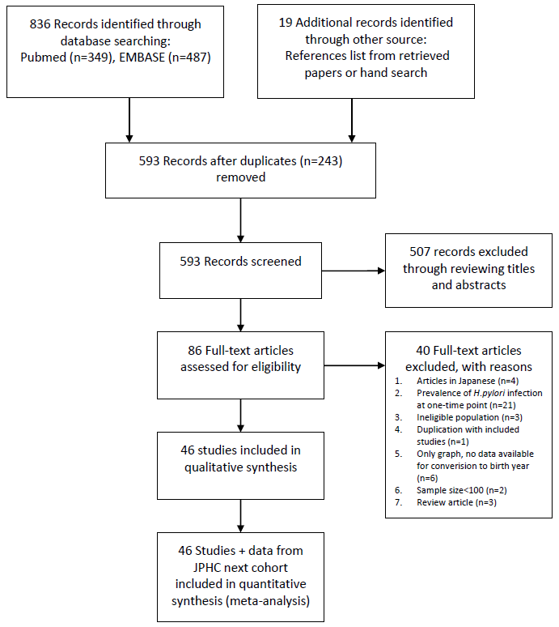
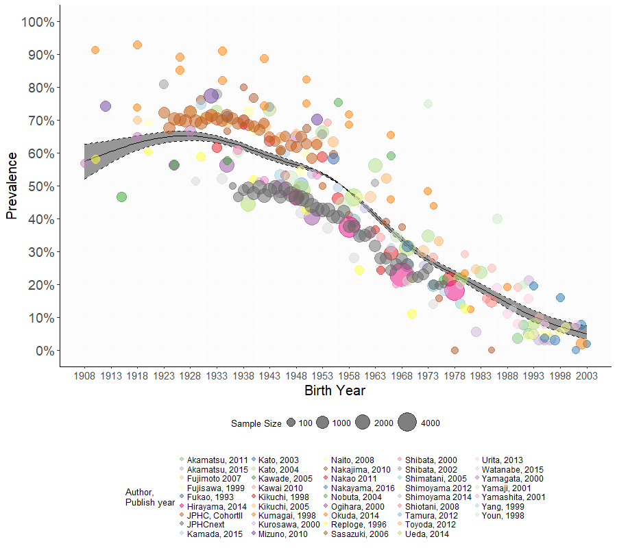

%% smart
%% to=latex
%% template=tex/poster_ocean.tex
%% filter=tex/poster-filters.py
%% biblatex

```{r packages-and-options, cache=FALSE}
library('ggplot2')
library('knitr')
theme_set(theme_grey(base_size=10))
knitr::opts_chunk$set(fig.width = 16, fig.height = 4)
```

[columns=2]

[column]

# BACKGROUND

-  Gastric cancer burden remains high in Japan, approximately 50,000 deaths/year in Japan (2nd leading cause of cancer deaths).

-  Evidence supports a central role for _H. pylori_ in the development of upper-gastrointestinal diseases, including peptic ulcer and noncardia gastric cancer.

-  Cross-sectional studies have suggested that the prevalence of _H. pylori_ infection increases with age, while the whole picture remains obscure.

-  We systematically reviewed the existing literature that presented estimates of the prevalence of _H. pylori_ infection in the Japanese population.

-  The obejectives are:  
   a) to derive a robust prevalence estimate of _H. pylori_ infection by birth year;   
   b) to clarify whether _H. pylori_ infection exhibits a birth-cohort pattern. 

<!--

- Standard abreviations \\eg and \\ie for \eg and \ie
- Units like \pps{900}
- **Highlights** and *highlights*

-->

# DATA SOURCES AND SEARCH STRATEGY

- The PRISMA statement for preferred reporting of systematic reviews and meta-analyses was used as a guide to conduct this study. (Fig.1. Flowchart of Study Selection) 

- **PubMed ** ("Helicobacter"[Mesh] OR "Helicobacter pylori"[title/abstract]) AND ("Prevalence"[Mesh] OR "prevalence"[title/abstract]) AND ("Japan"[Mesh] OR "Japan"[title/abstract] OR "Japanese"[title/abstract])

- **EMBASE **  ("prevalence"/exp OR prevalence:ab, ti) AND ("Japan"/exp OR "Japan: ab, ti" OR "Japanese: ab, ti") AND ("helicobacter"/exp OR "helicobacter pylori": ab, ti) AND (humans)/lim.

- We also scrutinised the reference lists, and searched for unpublished data by contacting the head of known ongoing study projects in Japan. 

- The risk-of-bias assessment was independently performed by two authors (LY and WC) using the Joanna Briggs Institute Prevalence Critical Appraisal Tool。



# STATISTICAL ANALYSIS (1)

- Prevalence by birth year were extracted from 45 studies (273 data points).

- Penalized cubic spline was used to model the prevalence as a function of birth year in the framework of generalized additive mixed model (GAMM) implemented in the `mgcv` package in R. 

[column]

# STATISTICAL ANALYSIS (2) 

- Pre-specified explanatory variables included in the meta-regression were as follows:   
  Study ID, birth year, population source (community-based or clinical-based), diagnostic testing (serological test, or others; others: urinary assays, salivary assays, stool antigen tests, and gastric biopsy), types of ELISA kits for measuring _H. pylori_ positivity (antigen derived from domestic or foreign strains), and data collection period (prior to the year 2000, or later than 2000), with **study ID as a random effect** and **other variables as fixed effects**.

- Observations weighted by the inverse of the sum of the within-study variance and the residual between-study variance using the `meta` package.


# RESULTS

- Details/characteristics of the studies included in the current meta-regression analysis are available [**online**](http://rpubs.com/winterwang/288338)^[http://rpubs.com/winterwang/288338]

- Summary of the results of risk of bias diagnosis is available [**here**](http://rpubs.com/winterwang/riskofbias)^[http://rpubs.com/winterwang/riskofbias]




\begin{table}[]
\centering
\captionof{Table 1. Prevalence of \textit{H. pylori} infection by birth year}
\label{my-label}
\begin{tabular}{@{}cccc@{}}
\toprule
Birth Year & Prevalence & 95\% CI low & 95\% CI high \\ \midrule
1908 & 0.574 & 0.520 & 0.626 \\
1909 & 0.580 & 0.530 & 0.628 \\
1910 & 0.586 & 0.540 & 0.631 \\
1911 & 0.592 & 0.549 & 0.633 \\
1912 & 0.597 & 0.559 & 0.635 \\
\dots & \dots & \dots & \dots \\
1925 & 0.650 & 0.634 & 0.667 \\
1926 & 0.651 & 0.635 & 0.667 \\
\rowcolor[HTML]{F8FF00} 
1927 & 0.652 & 0.636 & 0.666 \\
1928 & 0.651 & 0.637 & 0.665 \\
1929 & 0.651 & 0.637 & 0.664 \\
\dots & \dots & \dots & \dots \\
\rowcolor[HTML]{F8FF00} 
1996 & 0.080 & 0.064 & 0.100 \\
1997 & 0.075 & 0.059 & 0.095 \\
1998 & 0.070 & 0.054 & 0.091 \\
\dots & \dots & \dots & \dots \\
2002 & 0.053 & 0.036 & 0.076 \\
2003 & 0.049 & 0.032 & 0.074 \\ \bottomrule
\end{tabular}
\end{table}


# CONCLUSION

- Prevalence of _H. pylori_ infection exhibits **a birth cohort effect** in Japan, with prevalence decreasing steadily in individuals born in successive years, **from 55.6% in 1950 to 12.8% in 1990**.  

- Given the fact that the birth-cohort pattern of _H. pylori_ shapes the trends of gastric cancer over time, our findings help to inform screening efforts aimed at prevention and early detection of gastric cancer in Japan.


<!--\vskip0.5cm

[/columns]


[columns=2]

[column]

-->

# COI Declaration: None


<!--\vskip4.4cm-->

[/columns]
